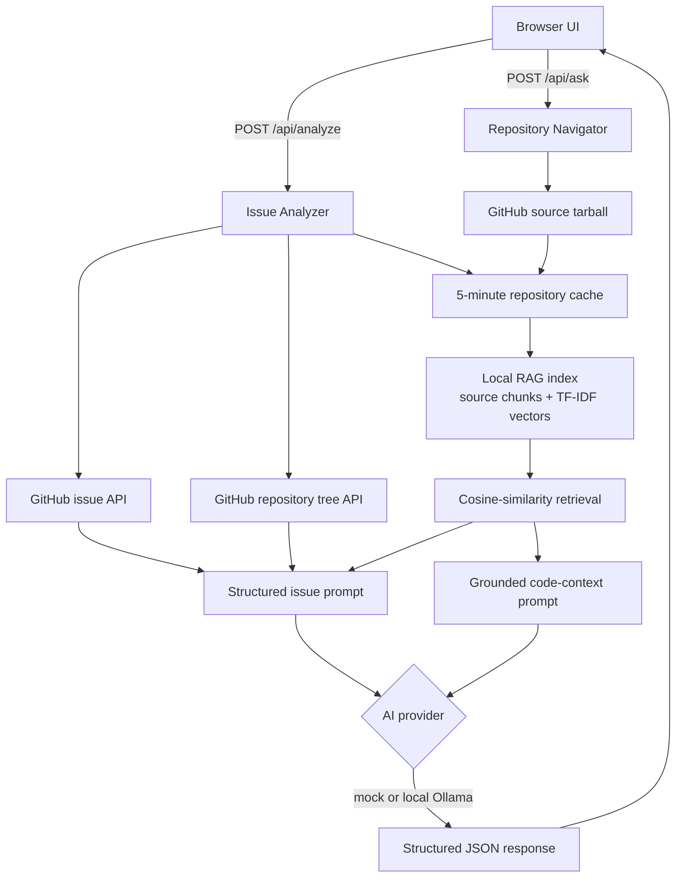

# ContriAI

**Understand. Contribute. Collaborate.**

ContriAI is an AI-powered assistant that helps a developer understand an
unfamiliar GitHub repository well enough to start contributing. It ships
two capabilities today:

**Issue Analyzer** — paste a GitHub issue URL; ContriAI fetches the issue,
maps the repository's file tree, retrieves relevant source chunks through the
local RAG index, and returns a structured breakdown: understanding, verified
relevant files, a suggested approach, and risks worth thinking about.

**Repository Navigator** — type a free-form question about any GitHub repo
("Where is authentication implemented?", "Which files handle CLI parsing?");
ContriAI downloads the actual source, chunks it into a local retrieval index,
finds the most relevant code sections with TF-IDF vector similarity, and
returns an answer that cites the exact files and source ranges it used.

It is **not** an autonomous PR bot. It never opens branches, writes code,
or submits pull requests on its own. It explains; the developer decides.

```
Issue Analyzer:
  GitHub issue URL → fetch issue + repo file tree + RAG source chunks
                   → grounded prompt + validated files → structured analysis

Repository Navigator:
  owner/repo + question → download source tarball → chunk + local vector index
                        → retrieve source ranges → grounded prompt + LLM
                        → answer + cited files
```

## How a request flows through ContriAI



The Navigator and Issue Analyzer share the downloaded-repository cache and its
local RAG index for five minutes. Every result exposes retrieved source ranges;
Issue Analyzer also discards model-suggested file paths that are not part of
the retrieved evidence.

## Quick start

Requires Go 1.22+.

```bash
git clone <this-repo>
cd contriai
go build -o contribai ./cmd/contribai
./contribai
```

Open **http://localhost:8080**, paste a GitHub issue URL (e.g.
`https://github.com/podman-container-tools/podman/issues/29265`), and hit
Analyze.

By default it runs with **zero external dependencies** using a built-in
heuristic provider (keyword overlap between the issue text and the
repository's file tree) — so the whole pipeline works out of the box, with
no API key and no model download. It's intentionally upfront that this
mode isn't real code understanding; see [AI providers](#ai-providers).

### Talking to GitHub

Unauthenticated requests share GitHub's public rate limit (60/hour), which
sandboxed CI environments often exhaust. For real use, set a token:

```bash
export GITHUB_TOKEN=ghp_your_token_here
./contribai
```

### AI providers

ContriAI's AI layer is provider-agnostic (`internal/ai.Provider`) so it
isn't locked to one backend:

| Provider | Env var | What it does |
|---|---|---|
| `mock` *(default)* | — | Deterministic keyword-ranking, no LLM, no network call to any AI service. It ranks issue file paths and repository-search snippets by keyword overlap, so both workflows work with zero setup (but it is not semantic code understanding). |
| `ollama` | `CONTRIBAI_PROVIDER=ollama` | Talks to a local [Ollama](https://ollama.com) daemon — your repository content and issue text never leave your machine. |

To use a local model:

```bash
ollama pull llama3.2
export CONTRIBAI_PROVIDER=ollama
export CONTRIBAI_OLLAMA_MODEL=llama3.2   # optional, this is the default
./contribai
```

Adding a cloud provider (Anthropic/OpenAI/etc.) is a matter of implementing
the two-method `Provider` interface — see `internal/ai/provider.go` — and
wiring it into `selectProvider()` in `cmd/contribai/main.go`. Nothing
elsewhere in the codebase needs to know which provider is active.

## Why it looks the way it does

The UI borrows its vocabulary from `git diff` on purpose, because that's
the mental model a contributor already has: relevant files are additions
(`+`), risks are things that could break (`-`), and the suggested approach
is context — the steps you walk through either way. It's meant to feel
like a tool a developer would actually keep open, not a chat window.

## Project layout

```
cmd/contribai/        entrypoint: HTTP server + embedded web UI
internal/github/      minimal read-only GitHub REST client
internal/ai/          provider-agnostic AI interface (mock + ollama)
internal/analysis/    Phase 1: issue analysis orchestration
internal/navigator/   Phase 2: repo download, code search, ask endpoint
```

Tests: `go test ./...`.
- `internal/analysis/integration_test.go` runs the Phase 1 pipeline
  against a fake GitHub server — deterministic, no network access.
- `internal/navigator/navigator_test.go` runs the Phase 2 pipeline
  against a fake tarball server and in-memory files — deterministic, no
  real GitHub access.

## Human-in-the-loop, by design

- ContriAI can: analyze, explain, search, recommend, generate a plan.
- ContriAI will never, silently: push code, modify files, open a PR,
  execute arbitrary commands, or send your source code to a cloud service
  you didn't explicitly configure.

## Roadmap

Phases 1, 2, and 3 are shipped. Each later phase is a real, separately-shippable
increment:

- **Phase 3 — Repository RAG.** Shipped: source is chunked and indexed in a
  local, in-memory TF-IDF vector store for the five-minute repository-cache
  lifetime. This improves retrieval granularity and provides inspectable line
  ranges without sending code to an embedding service. Semantic embeddings are
  a future enhancement.
- **Phase 4 — More local AI.** Broader local-model support beyond Ollama;
  provider selection already supports this without a redesign.
- **Phase 5 — Contribution planner.** Turn the approach list into a
  concrete, file-by-file implementation plan.
- **Phase 6 — Local code assistance.** Propose a diff for review — never
  applied without explicit developer approval.
- **Phase 7 — Test assistant.** Detect the test/build system, run it,
  explain failures.
- **Phase 8 — PR assistant.** Draft the PR title/description/summary for
  the developer to review and submit themselves.

## License

MIT
